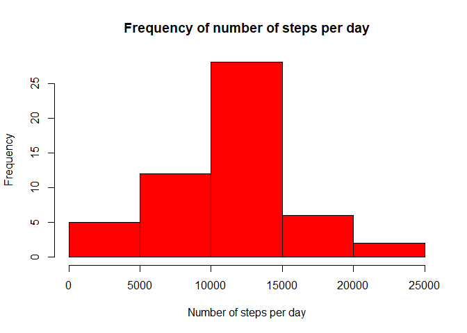
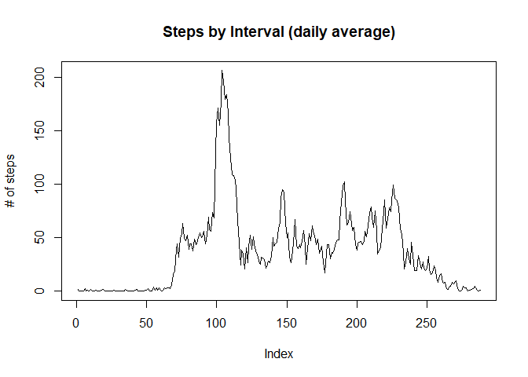
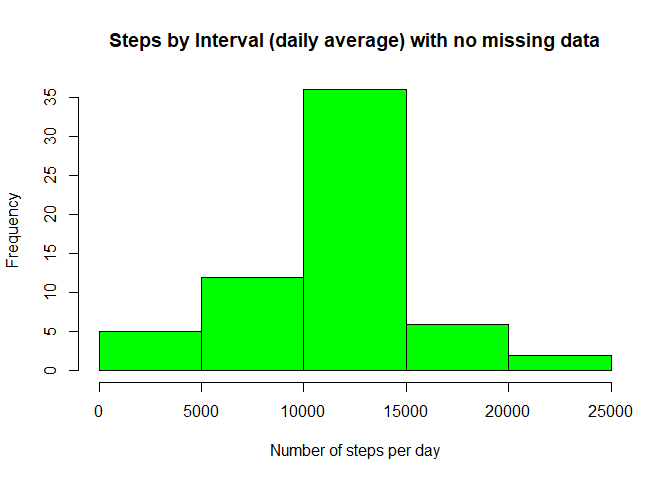
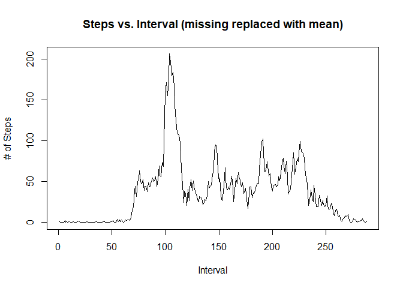
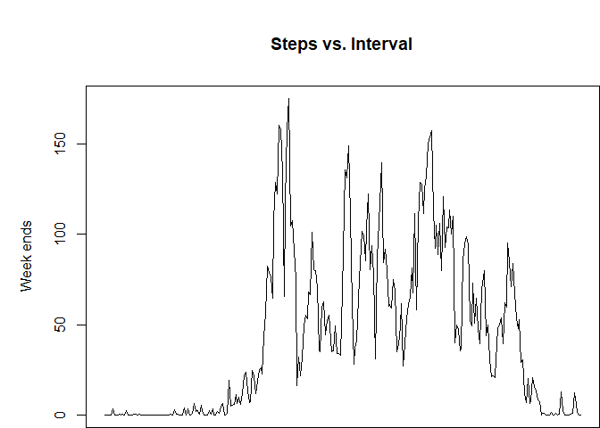
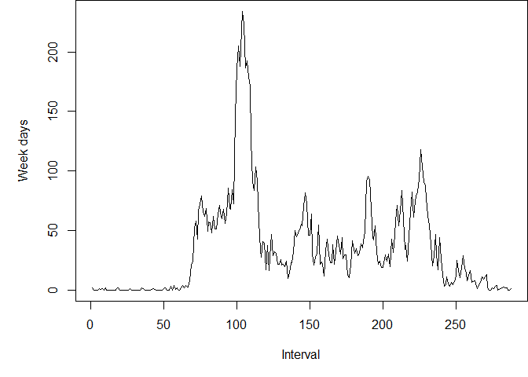

## Loading and preprocessing the data


```r
AMD<-read.csv(unzip("activity.zip"))
head(AMD)
```

```
##   steps       date interval
## 1    NA 2012-10-01        0
## 2    NA 2012-10-01        5
## 3    NA 2012-10-01       10
## 4    NA 2012-10-01       15
## 5    NA 2012-10-01       20
## 6    NA 2012-10-01       25
```

```r
AMD$date<-as.Date(AMD$date)
```


## What is mean total number of steps taken per day?


```r
aggAMD<-aggregate(AMD$steps, list(AMD$date), sum)
colnames(aggAMD) <-c ("date", "total")
hist(aggAMD$total, breaks = 6, main = "Frequency of number of steps per day", 
    xlab = "Number of steps per day", ylab = "Frequency", col = "red")
```

<!-- -->

Mean total number of steps taken per day:

```r
mean(aggAMD$total, na.rm = TRUE)
```

```
## [1] 10766.19
```

Median total number of steps taken per day:

```r
median(aggAMD$total, na.rm = TRUE)
```

```
## [1] 10765
```


## What is the average daily activity pattern?


```r
aggMeanAMD <- tapply(AMD$steps, AMD$interval, mean, na.rm = T)
plot(aggMeanAMD, type = "l", main = ("Steps by Interval (daily average)"), 
    ylab = "# of steps")
```

<!-- -->

Interval with the maximum number of steps:


```r
seq(along = aggMeanAMD)[aggMeanAMD == max(aggMeanAMD)]
```

```
## [1] 104
```


## Imputing missing values

Calculate and report the total number of missing values in the dataset (i.e. the total number of rows with NAs)


```r
sum(is.na(AMD$steps))
```

```
## [1] 2304
```


Deviсe a strategy for filling in all of the missing values in the dataset. The strategy does not need to be sophisticated. For example, you could use the mean/median for that day, or the mean for that 5-minute interval, etc.

Create a new dataset that is equal to the original dataset but with the missing data filled in

Make a histogram of the total number of steps taken each day and Calculate and report the mean and median total number of steps taken per day. Do these values differ from the estimates from the first part of the assignment? What is the impact of imputing missing data on the estimates of the total daily number of steps?


```r
# Get the steps mean per interval as a vector
tmp_aggMeanAMD <- as.vector(aggMeanAMD)
# Repeat it to be the same for each of the 61 days
tmp_aggMeanAMD <- rep(aggMeanAMD, 61)
# Set it one where there is no missin data
tmp_aggMeanAMD[!is.na(AMD$steps)] = 1

# Get the steps data as a vector
tmp_AMDTest <- as.vector(AMD$steps)
# Set it to one where data is missing
tmp_AMDTest[is.na(tmp_AMDTest)] = 1

AMD_NoMissing <- AMD
AMD_NoMissing$steps <- tmp_aggMeanAMD * tmp_AMDTest

aggAMD_NoMissing <- tapply(AMD_NoMissing$steps, AMD_NoMissing$date,sum)
hist(aggAMD_NoMissing, breaks = 6, main = "Steps by Interval (daily average) with no missing data", 
xlab = "Number of steps per day", ylab = "Frequency", col = "green")
```

<!-- -->

```r
aggMeanAMD_NoMissing <- tapply(AMD_NoMissing$steps, AMD_NoMissing$interval,mean)
```


The impact of the missing data on histogram is that the number (i.e. frequency) of data in the middle of histogram has increased since number of new data with the mean has been added.

Mean total number of steps taken per day (missing replaced by mean for that interval):

```r
mean(aggAMD_NoMissing)
```

```
## [1] 10766.19
```

Median total number of steps taken per day (missing replaced by mean for that interval):

```r
median(aggAMD_NoMissing)
```

```
## [1] 10766.19
```


```r
plot(aggMeanAMD_NoMissing, type = "l", xlab = "Interval", ylab = "# of Steps", 
    main = "Steps vs. Interval (missing replaced with mean)")
```

<!-- -->

## Are there differences in activity patterns between weekdays and weekends?

# Create a factor variable with two levels (weekday, weekend-day)

```r
tmpLT <- as.POSIXlt(AMD$date, format = "%Y-%m-%d")
tmpWeekDays <- tmpLT$wday
tmpWeekDays[tmpWeekDays == 0] = 0
tmpWeekDays[tmpWeekDays == 6] = 0
tmpWeekDays[tmpWeekDays != 0] = 1
tmpWeekDaysFactor <- factor(tmpWeekDays, levels = c(0, 1))
```
# Add the factor variable to the data


```r
AMD$WD <- tmpWeekDaysFactor
```

# Calculate the mean


```r
aggMeanAMDWeekday <- tapply(AMD$steps, list(AMD$interval, AMD$WD), mean, na.rm = T)
par(mfrow = c(2, 1))
```


# Display the 2 plots

```r
with(AMD, {
    par(mai = c(0, 1, 1, 0))
    plot(aggMeanAMDWeekday[, 1], type = "l", main = ("Steps vs. Interval"), 
        xaxt = "n", ylab = "Week ends")
    title = ("# of Steps v.s. Interval")
    par(mai = c(1, 1, 0, 0))
    plot(aggMeanAMDWeekday[, 2], type = "l", xlab = "Interval", ylab = "Week days")


})
```

<!-- --><!-- -->


